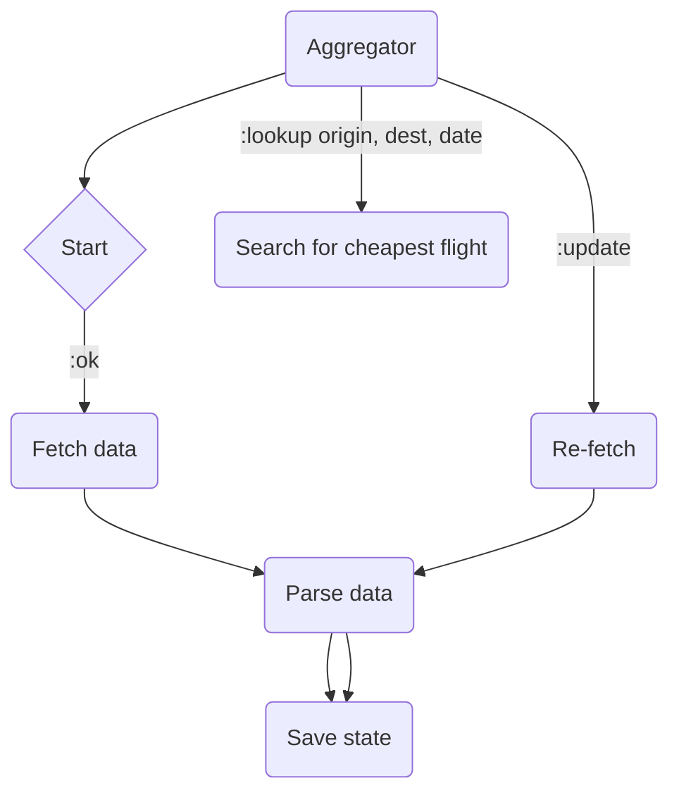

# CheapFlights 🛫


## 🏃 Running

To run you can just use `iex mix -S run` or if you have docker then please follow the commands below (it is just 33Mb)
```
make docker-image
docker run -p 127.0.0.1:8080:8080/tcp -it sultaniman/cheap-flights
```

Once it is done you can check out one of the following links


http://localhost:8080/findCheapestOffer/?origin=MUC&destination=LCY&departureDate=2021-09-28

`{"data":{"cheapestOffer":{"airline":"ba","amount":132.38}}}`

http://localhost:8080/findCheapestOffer/?origin=MUC&destination=CDG&departureDate=2021-09-26

`{"data":{"cheapestOffer":{"airline":"klm","amount":199.29}}}`

http://localhost:8080/findCheapestOffer/?origin=MUC&destination=LHR&departureDate=2021-09-28

`{"data":{"cheapestOffer":{"airline":"ba","amount":156.38}}}`

## 📚 Used libraries

* [`quantum`](https://hex.pm/packages/quantum) - is used to periodically fetch data for flights,
* [`tesla`](https://hex.pm/packages/tesla) - HTTP client,
* [`sweet_xml`](https://hex.pm/packages/sweet_xml) - XML parser,
* [`hackney`](https://hex.pm/packages/hackney) - Used as an adapter for Tesla,
* [`castore`](https://hex.pm/packages/castore) - cert store,
* [`typed_struct`](https://hex.pm/packages/typed_struct) - Used to define structs in a more convenient way,
* [`plug_cowboy`](https://hex.pm/packages/plug_cowboy) - Used to implement API endpoints,
* [`jason`](https://hex.pm/packages/jason) - JSON encoder,
* [`exvcr`](https://hex.pm/packages/exvcr) - Request recorder for tests.

## 🛠️ Configuration

## 🏗️ Structure

Under `lib/cheap_flights` you can find multiple modules.

### 🔮 Aggregator

Aggregator [`lib/cheap_flights/aggregator.ex`](./lib/cheap_flights/aggregator.ex) is a `GenServer` which is responsible

1. To fetch flight data from integrations,
2. Allows to lookup cheap flights,
3. Re-fetch flight data



### 🐝 Flight data API clients

Each client implements behaviour with a single callback

```ex
@callback load_data :: Dataset.t()
```

Where `lib/cheap_flights/integrations` is an entry point which allows to visit and call
each client in parallel then process and transform flight information.

You can find them under the following modules

```
├── behaviours
│   └── integration.ex
├── integrations
│   ├── air_france.ex
│   └── british_airways.ex
└── integrations.ex
```

### ❄️ Data structures

```
schemas
├── dataset.ex
├── flight_segment.ex
└── offer.ex
```

### REST API


