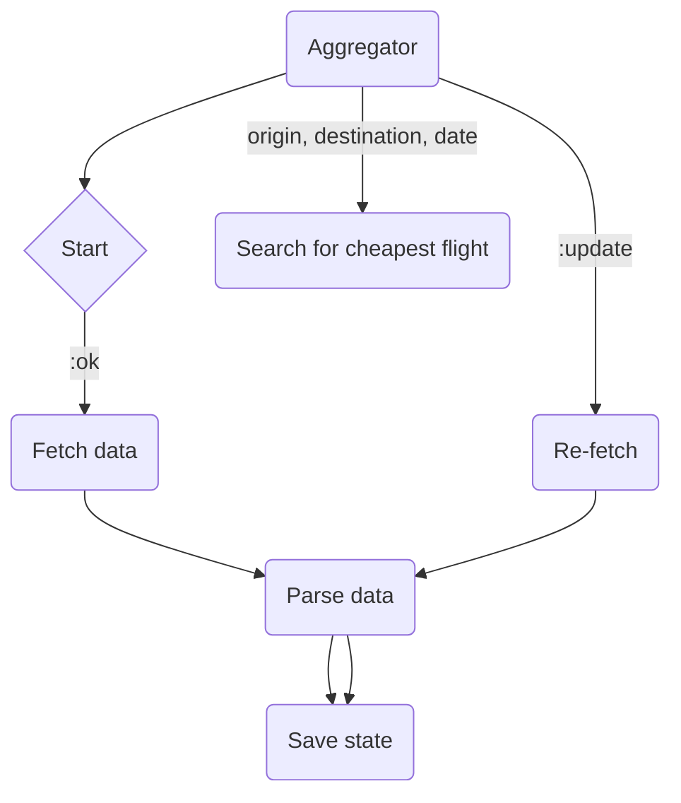
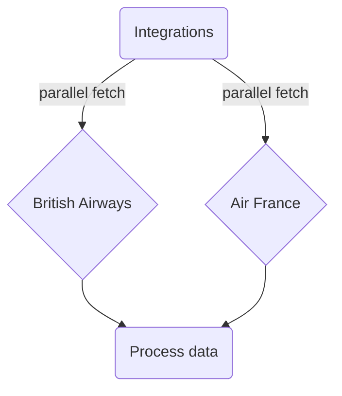

[](https://github.com/sultaniman/cheap-flights/actions/workflows/elixir.yml)

# 🛫 CheapFlights

Notes & assumptions:

  1. It is assumed that all external data sources will be available at all times,
  2. `departureDate` is always is correct and is treated as simple string,
  3. No complicated logic around guarantees present since this is not production grade solution,
  4. No new endpoints will be added thus simple `Plug.Router` should suffice,

For the [initial exploration and discovery](./api-exploration.livemd) I used [Livebook](https://livebook.dev/).
GitHub can render it as Markdown so you can safely preview code samples and the flow of discovery.

## 🏃 Running

Before you can run you need to install dependencies

```sh
mix deps.get
```

To run you can just use `iex mix -S run` or if you have docker then please follow the commands below (it is just ~34Mb)

```sh
make docker-image
docker run -p 127.0.0.1:8080:8080/tcp -it sultaniman/cheap-flights
```

Once it is done you can check out one of the following links


http://localhost:8080/findCheapestOffer/?origin=MUC&destination=LCY&departureDate=2021-09-28

```json
{"data":{"cheapestOffer":{"airline":"ba","amount":132.38}}}
```

http://localhost:8080/findCheapestOffer/?origin=MUC&destination=CDG&departureDate=2021-09-26

```json
{"data":{"cheapestOffer":{"airline":"klm","amount":199.29}}}
```

http://localhost:8080/findCheapestOffer/?origin=MUC&destination=LHR&departureDate=2021-09-28

```json
{"data":{"cheapestOffer":{"airline":"ba","amount":156.38}}}
```

## 📚 Used libraries

* [`quantum`](https://hex.pm/packages/quantum) - is used to periodically fetch data for flights using cron like interface,
* [`tesla`](https://hex.pm/packages/tesla) - HTTP client,
* [`sweet_xml`](https://hex.pm/packages/sweet_xml) - XML parser,
* [`hackney`](https://hex.pm/packages/hackney) - Used as an adapter for Tesla,
* [`castore`](https://hex.pm/packages/castore) - cert store,
* [`typed_struct`](https://hex.pm/packages/typed_struct) - Used to define structs in a more convenient way,
* [`plug_cowboy`](https://hex.pm/packages/plug_cowboy) - Used to implement API endpoints,
* [`jason`](https://hex.pm/packages/jason) - JSON encoder,
* [`cachex`](https://hex.pm/packages/cachex) - Caching,
* [`exvcr`](https://hex.pm/packages/exvcr) - Request recorder for tests.

## 🛠️ Configuration

[`config`](./config/) consists of `dev`, `test` and `runtime` configurations and it let's you

1. To configure available integrations,
2. To set server port,
3. Adjust CRON schedule to periodically re-fetch flight data from each integration source,
4. Set Tesla HTTP client adapter.

```ex
config :cheap_flights,
  integrations: [
    CheapFlights.Integrations.BritishAirways,
    CheapFlights.Integrations.AirFrance
  ]

config :cheap_flights, server_port: 8080

config :cheap_flights, CheapFlights.Scheduler,
  jobs: [
    # Update every 5 minutes
    {"*/5 * * * *", {CheapFlights.Aggregator, :update, []}}
  ]

config :tesla, :adapter, Tesla.Adapter.Hackney
```

Cron schedule to re-fetch flight data is set to run every 5 minutes and will replace current
in-memory state of [`Aggregator`](./lib/cheap_flights/aggregator.ex).

## 🚧 Testing

To run tests you can use either `make test` or simply call `mix test`.

[`ExVCR`](https://hex.pm/packages/exvcr) is used to capture then mock HTTP requests if you need to update request mocks then please
remove them using `mix vcr.delete --all` and re-run tests.

There is a known [issue](https://github.com/parroty/exvcr/issues/58) of `ExVCR` failing to mock requests withing spawned processes so some test might become flaky.
All relevant commands are under `mix vcr.*` you can find them all in the official documentation of `ExVCR`.

## 🧮 Code formatting

To format code `mix format` is used can be called via makefile `make fmt`

## 🏗️ Structure

Under `lib/cheap_flights` you can find multiple modules.

### 🔮 Aggregator

Aggregator [`lib/cheap_flights/aggregator.ex`](./lib/cheap_flights/aggregator.ex) is a `GenServer` which is responsible

1. To fetch flight data from integrations,
2. Allows to lookup cheap flights
  a. To avoid unnecessary work Cachex is used to cache lookup results
3. Re-fetch flight data



### 🐝 Flight data API clients

Each client implements behaviour with a single callback

```ex
@callback load_data :: Dataset.t()
```

Where `lib/cheap_flights/integrations` is an entry point which allows to visit and call
each client in parallel then process and transform flight information.

For each client I decided to hardcode endpoint url and provider code because it would create additional logic
which I think is not necessary in the context of this assignment.

```ex
@provider "klm"
@endpoint "https://gist.githubusercontent.com/kanmaniselvan/bb11edf031e254977b210c480a0bd89a/raw/ea9bcb65ba4bb2304580d6202ece88aee38540f8/afklm_response_sample.xml"
```

You can find them under the following modules

```
├── behaviours
│   └── integration.ex
├── integrations
│   ├── air_france.ex
│   └── british_airways.ex
└── integrations.ex
```



[`lib/cheap_flights/integrations.ex`](./lib/cheap_flights/integrations.ex) is an entry point which
allows to fetch flight data with each client in parallel.

### ❄️ Data structures

To represent offers and flight segments [`typed_struct`](https://hex.pm/packages/typed_struct) was used
to conveniently define data structures to work with instead of just using plain dictionaries.
Also this sets good mental model about data and the shape of it.

```
schemas
├── dataset.ex
├── flight_segment.ex
└── offer.ex
```

Example of an [offer](./lib/cheap_flights/schemas/offer.ex)
```ex
%Offer{
  segment_ids: ["BA3292"],
  provider: "ba",
  price: 132.38,
  offer_id: "OFFER1",
  currency: "EUR"
}
```

Example of [flight segment](./lib/cheap_flights/schemas/flight_segment.ex)
```ex
%FlightSegment{
  departure_date: "2021-09-28",
  segment_id: "BA3292",
  destination: "LCY",
  origin: "MUC"
}
```

[dataset.ex](./lib/cheap_flights/schemas/dataset.ex) is just a container type to keep the list of offers and flight segments.

### ⚡️ REST API

It is a simple `Plug.Route` implementation with a single endpoint `/findCheapestOffer` [router.ex](./lib/cheap_flights/api/router.ex)
If for the given query parameters there are no results it returns `HTTP 404` otherwise will return relevant response.

Regarding to notes about fault tolerance in my opinion since this solution has 4 components which can restart each on their own

1. Aggregator - GenServer,
2. Scheduler - Quantum scheduler,
3. Cache - using Cachex,
4. Router - API router

So `:one_for_one` restart policy shall suffice.

---------------------------------------------------------------------

<p align="center">
  ✨ 🍰 ✨&nbsp;&nbsp;&nbsp;&nbsp;&nbsp;&nbsp;&nbsp;&nbsp;&nbsp;&nbsp;&nbsp;&nbsp;
</p>
